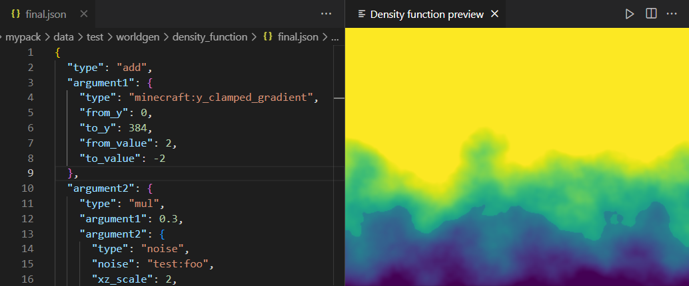
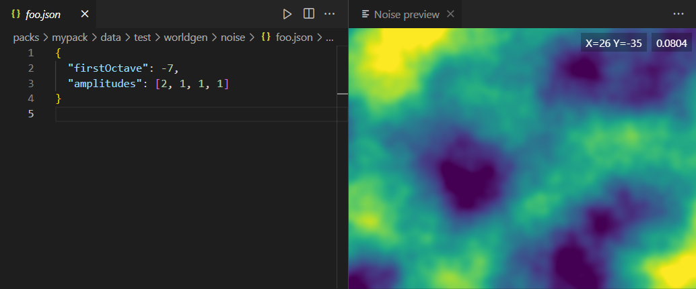

# Worldgen Tools
> VSCode extension to help with Minecraft worldgen development

## Usage
Open a file in `worldgen/noise` or `worldgen/density_function` and run the `Open visualizer for current file` command. A view will appear to the side.

## Features
- Density function and noise visualizers (more coming in the future!)
- Live-updates when changing the file or referenced files
- Able to reference vanilla files

